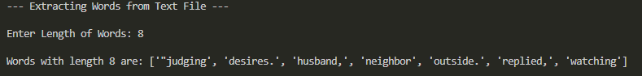

# AIM: Develop a Python program that reads a text file and prints words of specified lengths (e.g., three, four, five, etc.) found within the file.

NOTE: Given `story.txt` with sample paragraph

#### Input
```
Enter Length of Words: 5
```

#### Output : (Print only unique words in sorted order and in lower case)
```
Following Unique words of length 5 present: 
```

### Tips:
1. To get unique use Set
2. Sort the set using `sorted()` function
3. Convert to lower case using `.lower()` function

### Sample Output
